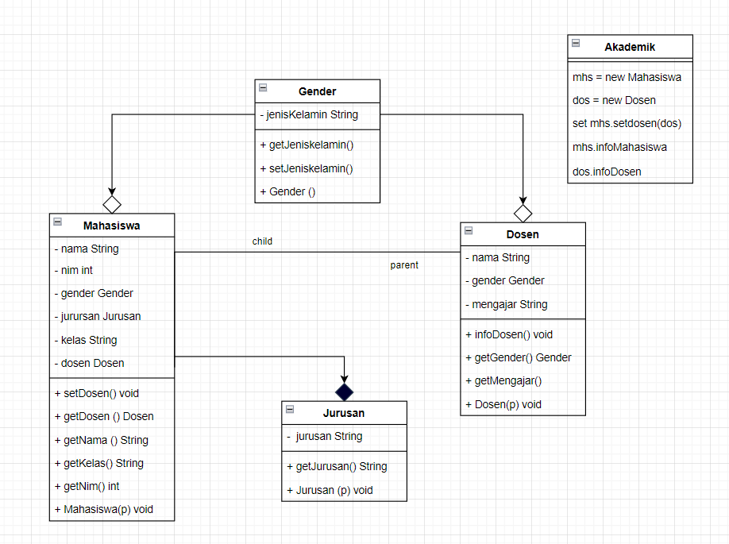

# Tugas Praktikum 7
## Pemrograman Orientasi Objek

```sh
Nama   : Raihan Tantowi
Nim    : 312110229
Matkul : Pemrograman Orientasi Objek
```
### Berikut adalah diagramnya


#### 1. File Mahasiswa.java
* **Langkah awal membuat class mahasiswa**
```java
package com.mycompany.tugaspraktikum7;


public class Mahasiswa {
    // Atribute
    private String nama;
    private int nim;
    private Gender gender;
    private Jurusan jurusan;
    private String kelas;
    private Dosen dosen;


    public void infoMahasiswa(){
        System.out.println("Data Mahasiswa :");
        System.out.println("NAMA \t\t\t:"+getNama());
        System.out.println("JENIS KELAMIN\t\t:"+gender.getJenisKelamin());
        System.out.println("KELAS \t\t\t:"+getKelas());
        System.out.println("NIM \t\t\t:"+getNim());
        System.out.println("JURUSAN \t\t:"+jurusan.getJurusan());
        // Asosiasi/use a dari class Dosen
        System.out.println("MATA KULIAH\t\t:"+getDosen().getMengajar());
        System.out.println("\n=======================================================");
    }

    public void setDosen(Dosen dosen) {
        this.dosen = dosen;
    }

    public Dosen getDosen() {
        return dosen;
    }

    public String getNama() {
        return nama;
    }

    public String getKelas() {
        return kelas;
    }
    public int getNim() {
        return nim;
    }

    // Constructor class Mahasiswa
    public Mahasiswa(String nama, String kelas, int nim, Gender gender){
        this.nama = nama;
        this.kelas =kelas;
        this.nim = nim;
        this.gender = gender;
        jurusan= new Jurusan("Teknik informatika");
    }

}
```

#### 2. File Dosen.java
* **Selanjutnya membuat class dosen**
```java
package com.mycompany.tugaspraktikum7;

public class Dosen {
    private String nama;
    private Gender gender;
    private String mengajar;

    public void infoDosen(){
        System.out.println("\nData Dosen :");
        System.out.println("NAMA \t\t\t:" +nama);
        System.out.println("JENIS KELAMIN\t\t:"+getGender().getJenisKelamin());
        System.out.println("MENGAJAR \t\t:" +getMengajar());


    }
    //Method SETTER GETTER
    public Gender getGender() {
        return gender;
    }
    public String getMengajar() {
        return mengajar;
    }

    //Constructor class Dosen
    public Dosen(String nama, String mengajar,Gender jenis){
        this.nama = nama;
        this.mengajar = mengajar;
        this.gender =jenis;
    }
}
```

#### 4. File Gender.java
* **Selanjutnya membuat class gender**
```java
package com.mycompany.tugaspraktikum7;

public class Gender {
    // Atribute
    private String jenisKelamin;

    //method SETTER GETTER
    public String getJenisKelamin() {
        return jenisKelamin;
    }
    // Constructor class Gender
    public Gender(String jenisKelamin){
        this.jenisKelamin = jenisKelamin;
    }
}
```

#### 5. File Jurusan.java
* **Selanjutnya membuat class Jurusan**
```java
package com.mycompany.tugaspraktikum7;

public class Jurusan {
    // Atribute
    private String jurusan;

    // Method SETTER GETTER
    public String getJurusan() {
        return jurusan;
    }

    public Jurusan(String jurusan){
        this.jurusan = jurusan;
    }

}
```

#### 6. File Akademik.java
* **Langkah terakhir membuat class main (Method main)**
```java
package com.mycompany.tugaspraktikum7;


public class Akademik {
    // Call Methode
    public static void main(String[] args) {
        //Menampilkan hasil Agregasi class Mahasiswa pada class Gender
        Mahasiswa mhs =new Mahasiswa("Raihan","TI.21.C.1",312110229,new Gender("Laki-laki"));
        //Menampilkan hasil Agregasi class Dosen pada class Gender
        Dosen dos = new Dosen("Agung Nugroho,S.Kom.,M.Kom","Pemrograman Orientasi Objek",new Gender("Laki-laki"));
        // menampilkan Mata Kuliah dengan setter hasil Asosiasi Mahasiswa use a Dosen
        mhs.setDosen(dos);
        //Menampilkan Method
        mhs.infoMahasiswa();
        dos.infoDosen();
    }
}
```

* **Berikut adalah hasil output program:**

